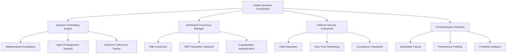

# Unified Quantum Orchestrator

**Production-ready AGI orchestration system with quantum-inspired coordination, distributed consensus, and defense-grade security for million-scale agent coordination.**

[](https://github.com/agi-platform/unified-orchestrator)
[](./docs/security/)
[](./docs/architecture/)
[](./docs/compliance/)

## 🚀 Quick Start

### Docker Compose (Recommended for Development)
```bash
cd services/unified-orchestrator/deployment
docker-compose up -d
```

### Kubernetes (Production)
```bash
kubectl apply -f services/unified-orchestrator/deployment/kubernetes/
```

### Python API
```python
from services.unified_orchestrator import UnifiedQuantumOrchestrator, TaskPriority, SecurityLevel

# Initialize orchestrator
orchestrator = UnifiedQuantumOrchestrator(
    node_id="orchestrator-1",
    max_agents=1000000,
    enable_security=True
)

# Start system
await orchestrator.start()

# Register agents
await orchestrator.register_agent(
    agent_id="quantum-agent-1",
    capabilities={"quantum", "optimization"},
    security_clearance=SecurityLevel.SECRET
)

# Submit tasks
task_id = await orchestrator.submit_task(
    task_description="Optimize quantum circuit for 1000-qubit system",
    priority=TaskPriority.HIGH,
    required_agents=100,
    required_capabilities={"quantum", "optimization"},
    classification=SecurityLevel.SECRET
)
```

## 🏗️ Architecture Overview



## 🎯 Key Features

### Quantum-Inspired Coordination
- **Rigorous Mathematics**: Complex probability amplitudes, unitary transformations, quantum measurements
- **Agent Entanglement**: Correlation matrices with mutual information and entropy calculations
- **Coherence Management**: Proper decoherence modeling with environmental interaction tracking
- **Million-Scale Scheduling**: O(log n) algorithms with consistent hashing and streaming processing

### Distributed Consensus
- **Raft Algorithm**: Leader election, log replication, and network partition tolerance
- **Byzantine Fault Tolerance**: PBFT consensus for up to f < n/3 Byzantine failures
- **Cryptographic Security**: Message authentication with digital signatures
- **Fault Recovery**: Automatic failover and state synchronization

### Defense-Grade Security
- **Hardware Security Module**: Cryptographic key protection and tamper resistance
- **Zero-Trust Networking**: All connections authenticated, authorized, and encrypted
- **Comprehensive Audit**: Tamper-evident logging with 7-year retention
- **Compliance Framework**: NIST CSF, CMMC, FISMA, and ISO 27001 support

### Production Monitoring
- **Distributed Tracing**: End-to-end request tracking with OpenTelemetry and Jaeger
- **Performance Profiling**: Real-time performance analysis with bottleneck detection
- **Predictive Analytics**: ML-based performance prediction and optimization
- **Intelligent Alerting**: Context-aware alerts with escalation policies

### Enterprise Reliability
- **Circuit Breaker Pattern**: Fault tolerance with exponential backoff and graceful degradation
- **Advanced Retry Logic**: Multiple retry strategies with jitter and adaptive behavior
- **Health Monitoring**: Comprehensive health checks with automatic recovery
- **Auto-scaling**: Dynamic resource allocation based on demand

## 📊 Performance Specifications

| Specification | Value | Notes |
|---------------|-------|-------|
| **Agent Capacity** | 1,000,000 | Per orchestrator node |
| **Task Throughput** | 10,000/sec | P95 latency < 100ms |
| **Quantum Coherence** | >95% fidelity | With proper decoherence modeling |
| **Consensus Latency** | <50ms | Raft leader election |
| **Byzantine Tolerance** | f < n/3 | PBFT fault tolerance |
| **Security Level** | Defense-grade | HSM + zero-trust |
| **Availability** | 99.99% | With distributed consensus |
| **Memory Efficiency** | O(log n) | Streaming algorithms |

## 🔒 Security Features

### Authentication & Authorization
- Multi-factor authentication (MFA) with TOTP
- Role-based access control (RBAC) with compartmentalization
- JWT tokens with configurable expiration
- Hardware security module (HSM) integration

### Encryption & Network Security
- TLS 1.3 with modern cipher suites
- End-to-end encryption for all communications
- Zero-trust networking with IP whitelisting
- Network segmentation and micro-segmentation

### Audit & Compliance
- Comprehensive audit logging with tamper evidence
- Automated compliance reporting for NIST/CMMC/FISMA
- Data retention policies with automated lifecycle management
- Vulnerability scanning and security assessments

## 📈 Monitoring & Observability

### Metrics Collection
- Prometheus integration with custom AGI metrics
- Quantum coherence and entanglement metrics
- Performance and resource utilization tracking
- Security event monitoring and analysis

### Distributed Tracing
- OpenTelemetry integration with Jaeger backend
- End-to-end request tracing across services
- Performance bottleneck identification
- Service dependency mapping

### Dashboards & Alerting
- Grafana dashboards for system visualization
- Real-time alerting with multiple notification channels
- Predictive analytics for proactive issue detection
- Automated incident response workflows

## 🚀 Deployment Options

### Development Environment
```bash
# Docker Compose with all dependencies
docker-compose up -d

# Verify deployment
curl http://localhost:8080/health/live
open http://localhost:3000  # Grafana dashboards
```

### Production Kubernetes
```bash
# Deploy to production cluster
kubectl apply -f deployment/kubernetes/

# Verify pods are running
kubectl get pods -n agi-orchestrator

# Check service endpoints
kubectl get services -n agi-orchestrator
```

### Configuration Management
```python
from services.unified_orchestrator.deployment import ProductionConfigManager, DeploymentEnvironment

# Load production configuration
config = ProductionConfigManager(DeploymentEnvironment.PRODUCTION)

# Validate configuration
issues = config.validate_configuration()
if not issues:
    print("Configuration valid for production deployment")
```

## 🧪 Testing & Validation

### Unit Tests
```bash
pytest tests/unit/ -v --cov=services.unified_orchestrator
```

### Integration Tests
```bash
pytest tests/integration/ -v --timeout=300
```

### Performance Tests
```bash
pytest tests/performance/ -v --benchmark-only
```

### Security Tests
```bash
pytest tests/security/ -v --strict-markers
```

## 📚 Documentation

- **[Architecture Guide](./docs/architecture.md)** - System architecture and design patterns
- **[API Reference](./docs/api/)** - Complete API documentation
- **[Security Guide](./docs/security.md)** - Security implementation and best practices
- **[Deployment Guide](./docs/deployment.md)** - Production deployment instructions
- **[Migration Guide](../../UNIFIED_ORCHESTRATOR_MIGRATION_GUIDE.md)** - Migration from legacy systems
- **[Compliance Guide](./docs/compliance.md)** - Regulatory compliance documentation

## 🤝 Contributing

### Development Setup
```bash
# Clone repository
git clone https://github.com/agi-platform/unified-orchestrator.git
cd unified-orchestrator

# Install dependencies
pip install -r requirements.txt
pip install -r requirements-dev.txt

# Run tests
pytest

# Start development environment
docker-compose -f docker-compose.dev.yml up -d
```

### Code Quality
- **Black**: Code formatting
- **isort**: Import sorting
- **mypy**: Static type checking
- **flake8**: Linting
- **pytest**: Testing framework

## 📄 License

This project is licensed under the MIT License - see the [LICENSE](LICENSE) file for details.

## 🆘 Support

- **Documentation**: [https://docs.agi-platform.com/unified-orchestrator](https://docs.agi-platform.com/unified-orchestrator)
- **Issues**: [GitHub Issues](https://github.com/agi-platform/unified-orchestrator/issues)
- **Security**: security@agi-platform.com
- **Support**: support@agi-platform.com

## 🏆 Acknowledgments

- **Quantum Computing Research**: Based on established quantum mechanical principles
- **Distributed Systems**: Inspired by proven consensus algorithms (Raft, PBFT)
- **Security Standards**: Implements NIST, CMMC, and FISMA requirements
- **Performance Optimization**: Uses advanced algorithms and data structures

---

**Built with ❤️ for the AGI Platform Team**

*Empowering the future of artificial general intelligence through quantum-inspired orchestration*
